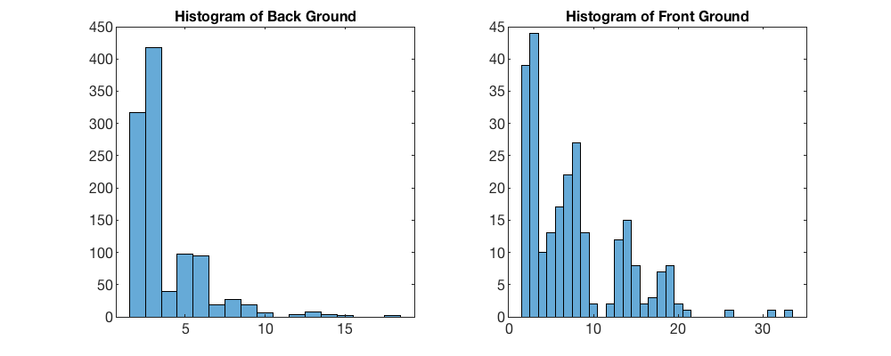

### P1 Report

___

**This is the first in a series of computer problems where I will get a feel for the difficulty of practical pattern recognition problems, such as computer vision. The goal is to segment the “cheetah” image (shown below in the left) into its two components, cheetah (foreground) and grass (background).**

**a)** using the training data in TrainingSamplesDCT 8.mat, what are reasonable estimates for the prior
probabilities?

With the data in the TrainingSamplesDCT 8.mat, which include TrainsampleDCT_BG and TrainsampleDCT_FG, I can calculate the two prior probabilities ($N_{FG}$ is the number of cheetah points, $N_{BG}$ is the number of grass points):
$$
P_Y(BG)=\frac{N_{BG}}{N_{BG}+N_{FG}}=0.8081
$$
$$
P_Y(FG)=\frac{N_{FG}}{N_{BG}+N_{FG}}=0.1919
$$

​	

**b)** using the training data in TrainingSamplesDCT 8.mat, compute and plot the index histograms
$P_{X|Y }(x|cheetah)$ and $P_{X|Y} (x|grass)​$.

Firstly, I sort the absolute values in TrainsampleDCT_BG and TrainsampleDCT_FG for each line, so I can get the second large value's index (determined by the "Zigzag" order) for each line. After that I can draw two Histograms as below:



Then, I create two arrays both are in size $(1, 64)$ to store the probabilities for each "index" from 1 to 64,  in both Back ground (grass) and Front ground (cheetah) situation.

Finally, I can have the $P_{X|Y}(x|cheetah)$ and $$P_{X|Y}(x|grass)$$ for each $X\in [1,\quad 64]$ .

**c)** for each block in the image cheetah.bmp, compute the feature X (index of the DCT coefficient with
2nd greatest energy). Compute the state variable Y using the minimum probability of error rule based
on the probabilities obtained in **a)** and **b)**. Store the state in an array A. Using the commands `imagesc`
and `colormap(gray(255))` create a picture of that array.

Firstly, I have to calculate the "Index" for every point in origin image. I traverse all points with two "for loop", calculate the `dct2()` of every $8\times 8$ matrix (the point I traverse is at the matrix's left top). 

When I traverse at some points that close to the boundary, there is not enough elements to construct the $8\times 8$ matrix. I use the "Auto Padding" function of `dct2()`. The "Auto Padding" function will create "0"s to make sure there is a  $8\times 8$ matrix. With this $8\times 8$ matrix, reorder it in "Zigzag" rule and store the second large number's index for this traversed point.

After the loop, I have an array that store the "Index" for every points in origin image.

With the probabilities from **a)** and **b)**, I can determine every point in original image is Cheetah or Grass, according with this function:
$$
i^*(x)=\underset { i }{ argmax } [{ P }_{ X|Y }(x|i){ P }_{ Y }(i)]
$$
Then I have the Calculated Image. There is the camparasion below:


**d)** The array A contains a mask that indicates which blocks contain grass and which contain the
cheetah. Compare it with the ground truth provided in image cheetah mask.bmp (shown below on the
right) and compute the probability of error of your algorithm.

According the error calculation function:
$$
PoE=\underset { i }{ \Sigma  } P_{ X|Y }(g(x)!=i|i)P_{ Y }(i)
$$
$$
{ P }_{ X|Y }(g(x)!=i|i)=\frac { { N }_{ g(x)!=i } }{ { N }_{ Y=i } } 
$$

So I just traverse every point, store the number or misclassified points for grass and cheetah, and calculate the final result.
$$
Error = 0.1726
$$

___

#### Source Code

```matlab
%-----------Training Part-------------------------
load('TrainingSamplesDCT_8.mat');

% Sort the absolute value and store those index
[~, BG_pos] = sort(abs(TrainsampleDCT_BG), 2, 'descend');
[~, FG_pos] = sort(abs(TrainsampleDCT_FG), 2, 'descend');
BG_pos = BG_pos(:, 2);
FG_pos = FG_pos(:, 2);

figure(1);
subplot(1,2,1);
histogram(BG_pos);
title('Histogram of Back Ground');
subplot(1,2,2);
histogram(FG_pos);
title('Histogram of Front Ground');
% Store the appearing times of every index which is from 1 to 64
BG_map = zeros(1, 64);
FG_map = zeros(1, 64);

for i = 1:1053
    BG_map(BG_pos(i)) = BG_map(BG_pos(i)) + 1;
end
for i = 1:250
    FG_map(FG_pos(i)) = FG_map(FG_pos(i)) + 1;
end

% Calculate the probility of every index
BG_map = BG_map/1053;
FG_map = FG_map/250;

% Calculate the prior probility
PYiBG = 1053/(1053+250);
PYiFG = 250/(1053+250);

% Calculate the best choice for every index, front equal 1, back equal 0
list = zeros(1, 64);
for i = 1:64
    if FG_map(i)*PYiFG > BG_map(i)*PYiBG
        list(i) = 1;
    end
end

%----------------Calculation Part------------------------------
A = imread("cheetah.bmp");
A = im2double(A);
load('Zig-Zag Pattern.txt');
zigzag = Zig_Zag_Pattern + 1;
res = zeros(255, 270);

% Traverse all point and store their "Index", which is from 1 to 64
for i = 1 : 255
    for j = 1 : 270
        window = dct2(A(i:min(i+7, 255), j:min(j+7, 270)), 8,8);
        tmp = zeros(1, 64);
        tmp(zigzag) = window;
        [~, tmp_pos] = sort(abs(tmp), 'descend');
        res(i, j) = tmp_pos(2);
    end
end

% According with the "Best choice rule", set the value for every point
res_img = zeros(255, 270);
for i = 1 : 255
    for j = 1 : 270
        res_img(i, j) = list(res(i, j));
    end
end

% Calculate the error
eB2F = 0;% the times that the back point was misclassified as front
eF2B = 0;
numB = 0;% the number of back points
numF = 0;
O = imread('cheetah_mask.bmp');

figure(2);
subplot(1,2,1);
imagesc(res_img);
colormap(gray(255));
title('Calculated Image');
subplot(1,2,2);
imagesc(O);
colormap(gray(255));
title('Correct Image');

for i = 1 : 255
    for j = 1 : 270
        
        if O(i, j) == 255
            numF = numF + 1;
        else
            numB = numB + 1;
        end
        
        if res_img(i, j)==0 && O(i, j)==255
            eF2B = eF2B + 1;
        end
        
        if res_img(i, j)==1 && O(i, j)==0
            eB2F = eB2F + 1;
        end
    end        
end

e = PYiFG*eF2B/numF + PYiBG*eB2F/numB;
% e = 0.1726
```

