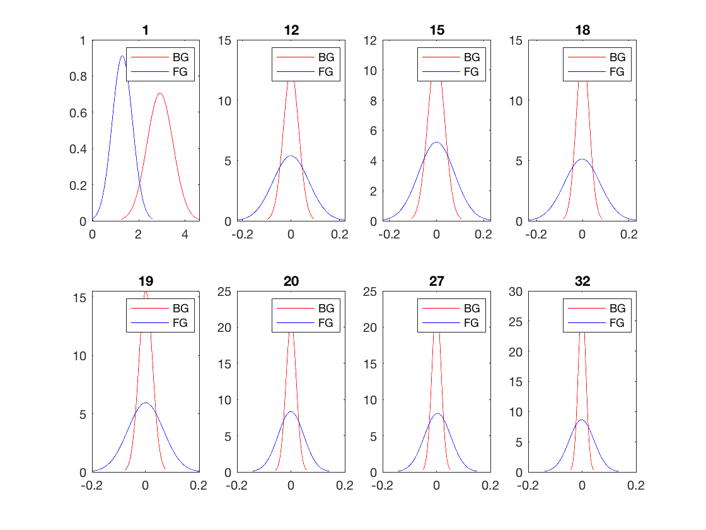

### HW1 Report

##### Jialun Lyu	A53267200

------

This week we will continue trying to classify our cheetah example. Once again we use the decomposition into $$8 × 8​$$ image blocks, compute the DCT of each block, and zig-zag scan. However, we are going to assume that the class-conditional densities are  multivariate Gaussians of 64 dimensions.

**a)**

According with the result in problem 2, for a random variable $$X$$ such that $$P_{ X }(k)=π_{ k },k∈{ \left\{ 1,...,N \right\}  }$$ , we can have the ML estimate:
$$
π_{ j }^{ ∗ }=\frac { c_{ j } }{ n } 
$$
Apply it into our case, we have:
$$
P_Y(BG)=\frac{N_{BG}}{N_{BG}+N_{FG}}=0.8081
$$

$$
P_Y(FG)=\frac{N_{FG}}{N_{BG}+N_{FG}}=0.1919
$$

The result is just like we had in last week.

**b)**

Just like the discussion in the class, to have maximum likelihood estimates for the parameters of a Gaussian distribution, I just need calculate as below:

For mean
$$
\overline { T } \quad =\quad \frac { 1 }{ N } \sum _{ i=1 }^{ N }{ T_{ i } }
$$
For variance
$$
{ \hat { \sigma  }  }_{ T }^{ 2 }=\frac { 1 }{ N } \sum _{ i=1 }^{ N }{ (T_{ i }-\overline { T } )^{ 2 } } 
$$
For the mean, I call the function `mean()`  and `cov()` in Matlab to get the value(For variance, I just calculated the covariance because in this problem we focus on multi dimension Gaussian distribution). One thing worth mentioned is that, after the `cov()`,  I still have to use `sqrt()` to get the correct value. Finally, I have two $$1\times 64$$ vectors for Cheetah and Grass denoting the mean, and two $$64\times64$$ vectors for the covariance matrix.

With the function `normpdf(x,mu,sigma)` , I can draw 64 figures which shows the comparing distribution for Cheetah and Grass across 64 dimensions. I chose the best 8 features for classification purposes:



And  the worst 8 features as below:


**c)**

To compute the Bayesian decision rule and classify the locations of the cheetah image, we can use this function:
$$
i^*(x)=argmin[d_{ i }(x,μ_{ i })+α_{ i }]
$$
With
$$
d_{ i }(x,y)=(x−y)^{ T }{ \Sigma  }_{ i }^{ -1 }(x−y)
$$

$$
α_{ i }=log(2π)^{ d }\left| { \Sigma  }_{ i } \right| −2logP_{ Y }(i)
$$

Then, I calculated the DCT value vector for every point in original image. Just as the request in problem, I had a $$1\times64$$ vector for 64 dimension Gaussian and $$1\times 8$$ vector for 8 dimension Gaussian. This process is just like traversing every point, calculate with `dct2()` function. For the boundary points, I used `padarray()` function to pad the origin image, so the `dct2()` function can have enough elements  to calculate in $$8\times 8$$ matrix.

Then, I compared the $$d_{i}(x,μ_{ i })+α_{ i }$$ for $$i=0$$ and $$i=1$$, so I can determine the every point belongs to Cheetah or Grass. 

The correct image:


The comparing image for 64 dimension and 8 dimension:


For calculation error, I use the  error calculation function:
$$
PoE=\underset { i }{ \Sigma  } P_{ X|Y }(g(x)!=i|i)P_{ Y }(i)
$$

$$
{ P }_{ X|Y }(g(x)!=i|i)=\frac { { N }_{ g(x)!=i } }{ { N }_{ Y=i } } 
$$

So I just traverse every point, store the number or misclassified points for grass and cheetah, and calculate the final result.
$$
Error64=0.1152
$$

$$
Error8=0.0745
$$

Comparing the result, I think within the 8 dimension version, we just ignore those features lacking "Classify Ability", which means the distribution of 2 class are too "Close" to each other. Instead,  we only use those features that the Cheetah distribution and Grass distribution are distributed "Far away" from each other. Those key feature help me better classify the pattern. 

___

#### Source Code

```matlab
clc;
clear;

load('TrainingSamplesDCT_8_new.mat');

sz = size(TrainsampleDCT_BG);
szBG = sz(1);
sz = size(TrainsampleDCT_FG);
szFG = sz(1);

PYiBG = szBG/(szBG + szFG);
PYiFG = 1 - PYiBG;

% Calculate the mean and covariance of trainning sample
meanBG64 = mean(TrainsampleDCT_BG);
meanFG64 = mean(TrainsampleDCT_FG);
covBG64 = cov(TrainsampleDCT_BG);
covFG64 = cov(TrainsampleDCT_FG);
sigmaBG64 = sqrt(covBG64);
sigmaFG64 = sqrt(covFG64);

%  Draw the 64 figures of Gaussian Distribution for Cheetah and Grass
x = 0;
y = 0;
for j = 0:3
    figure(j+1);
    for i = 1+16*j:16+16*j
        subplot(4,4,i-16*j);
        x = meanBG64(i)-sigmaBG64(i,i)*3:sigmaBG64(i,i)/100:meanBG64(i)+sigmaBG64(i,i)*3;
        y=normpdf(x,meanBG64(i), sigmaBG64(i,i));
        plot(x, y, 'r');
        hold on;
        x = meanFG64(i)-sigmaFG64(i,i)*3:sigmaFG64(i,i)/100:meanFG64(i)+sigmaFG64(i,i)*3;
        y=normpdf(x,meanFG64(i),sigmaFG64(i,i));
        plot(x, y, 'b');
        legend('BG', 'FG');
        s = num2str(i);
        title(s);
    end
end

% Pick the best 8 figures and draw them
pickID = [1 12 15 18 19 20 27 32];

t = 0;
figure(5);
for i = 1:8
    t = pickID(i);
    subplot(2,4,i);
    x = meanBG64(t)-sigmaBG64(t,t)*3:sigmaBG64(t,t)/100:meanBG64(t)+sigmaBG64(t,t)*3;
    y=normpdf(x,meanBG64(t), sigmaBG64(t,t));
    plot(x, y, 'r');
    hold on;
    x = meanFG64(t)-sigmaFG64(t,t)*3:sigmaFG64(t,t)/100:meanFG64(t)+sigmaFG64(t,t)*3;
    y=normpdf(x,meanFG64(t),sigmaFG64(t,t));
    plot(x, y, 'b');
    legend('BG', 'FG');
    s = num2str(t);
    title(s);
end

% Pick the worst 8 figures and draw them
pickWorst = [3 4 5 59 60 62 63 64];
figure(6);
for i = 1:8
    t = pickWorst(i);
    subplot(2,4,i);
    x = meanBG64(t)-sigmaBG64(t,t)*3:sigmaBG64(t,t)/100:meanBG64(t)+sigmaBG64(t,t)*3;
    y=normpdf(x,meanBG64(t), sigmaBG64(t,t));
    plot(x, y, 'r');
    hold on;
    x = meanFG64(t)-sigmaFG64(t,t)*3:sigmaFG64(t,t)/100:meanFG64(t)+sigmaFG64(t,t)*3;
    y=normpdf(x,meanFG64(t),sigmaFG64(t,t));
    plot(x, y, 'b');
    legend('BG', 'FG');
    s = num2str(t);
    title(s);
end

% Extract the value of 8 best features and calculate their mean and
% covariance
pickBG = zeros(szBG, 8);
pickFG = zeros(szFG, 8);
for i = 1 : 8
    pickBG(:, i) = TrainsampleDCT_BG(:, pickID(i));
    pickFG(:, i) = TrainsampleDCT_FG(:, pickID(i));
end
meanBG8 = mean(pickBG);
meanFG8 = mean(pickFG);
covBG8 = cov(pickBG);
covFG8 = cov(pickFG);

% calculate the 64 dimensional features for every point in origin image,
% for the 8 dimensional feature just pick out them from 64 dimensional
% feature vectors with the pickID
A = imread("cheetah.bmp");
A = im2double(A);
Apad = padarray(A,[7 7],'symmetric','post'); % Pad the origin image
load('Zig-Zag Pattern.txt');
zigzag = Zig_Zag_Pattern + 1;

correctImg = imread('cheetah_mask.bmp');
calculatedImg64 = zeros(255, 270);
calculatedImg8 = zeros(255, 270);

aBG64 = log((2*pi)^64*det(covBG64)) - 2*log(PYiBG); % Calculate the alpha value in BDR function
aFG64 = log((2*pi)^64*det(covFG64)) - 2*log(PYiFG);
aBG8 = log((2*pi)^8*det(covBG8)) - 2*log(PYiBG);
aFG8 = log((2*pi)^8*det(covFG8)) - 2*log(PYiFG);
feature64 = zeros(1, 64);
feature8 = zeros(1, 8);

for i = 1 : 255
    for j = 1 : 270
        window = dct2(Apad(i:i+7, j:j+7), 8, 8);
        feature64(zigzag) = window;
        dBG64 = (feature64 - meanBG64)/(covBG64)*(feature64 - meanBG64)'; % Calculate the d value in the BDR function
        dFG64 = (feature64 - meanFG64)/(covFG64)*(feature64 - meanFG64)';
        if (dBG64 + aBG64 > dFG64 + aFG64)
            calculatedImg64(i, j) = 1;
        end
        
        for k = 1:8
           feature8(k) = feature64(pickID(k));
        end
        dBG8 = (feature8 - meanBG8)/(covBG8)*(feature8 - meanBG8)';
        dFG8 = (feature8 - meanFG8)/(covFG8)*(feature8 - meanFG8)';
        if (dBG8 + aBG8 > dFG8 + aFG8)
            calculatedImg8(i, j) = 1;
        end
    end
end

% Draw the calculated image for 64 dimensional version and 8 dimensional
% version
figure(7);
subplot(1,2,1);
imagesc(calculatedImg64);
colormap(gray(255));
title('Calculated64 Image');
subplot(1,2,2);
imagesc(calculatedImg8);
colormap(gray(255));
title('Calculated8 Image');

% Draw the correct image
figure(8);
imagesc(correctImg);
colormap(gray(255));
title('Correct Image');

% Calculate the error for 64 dimension version and 8 dimension version
eB2F64 = 0;% the times that the back point was misclassified as front
eF2B64 = 0;
eB2F8 = 0;% the times that the back point was misclassified as front
eF2B8 = 0;
numB = 0;% the number of back points
numF = 0;

for i = 1 : 255
    for j = 1 : 270
        
        if correctImg(i, j) == 255
            numF = numF + 1;
        else
            numB = numB + 1;
        end
        
        if calculatedImg64(i, j)==0 && correctImg(i, j)==255
            eF2B64 = eF2B64 + 1;
        end
        
        if calculatedImg64(i, j)==1 && correctImg(i, j)==0
            eB2F64 = eB2F64 + 1;
        end
        
        if calculatedImg8(i, j)==0 && correctImg(i, j)==255
            eF2B8 = eF2B8 + 1;
        end
        
        if calculatedImg8(i, j)==1 && correctImg(i, j)==0
            eB2F8 = eB2F8 + 1;
        end
    end        
end

e64 = PYiFG*eF2B64/numF + PYiBG*eB2F64/numB; % 0.1152
e8 = PYiFG*eF2B8/numF + PYiBG*eB2F8/numB; % 0.0745

```

