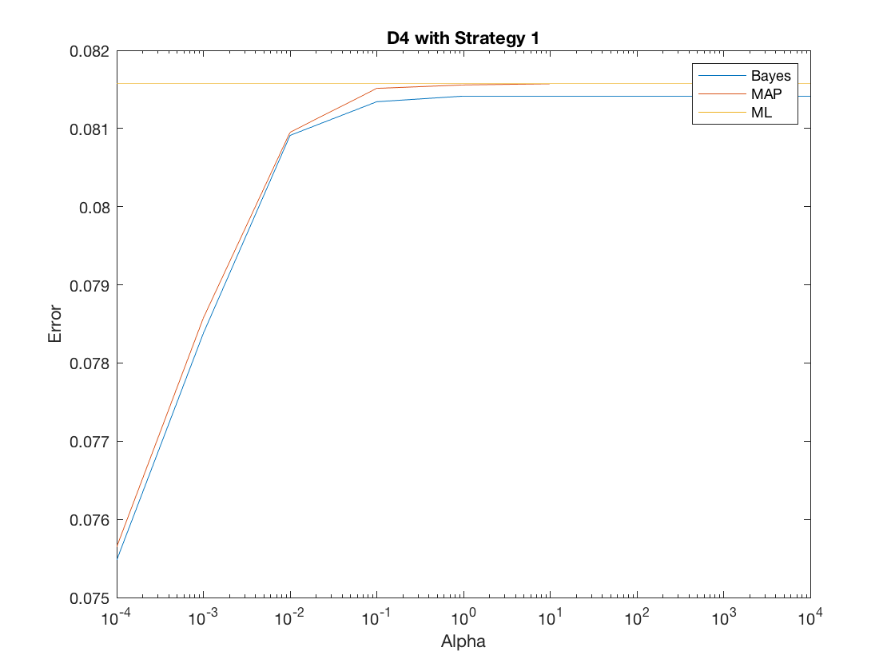

### P3 Report

------

This week we will continue trying to classify our cheetah example. Once again we use the decomposition into 8 × 8 image blocks, compute the DCT of each block, and zig-zag scan. We also continue to assume that the class-conditional densities are multivariate Gaussians of 64 dimensions. The goal is to understand the benefits of a Bayesian solution.

**a)** **Bayesian**

Firstly, we used the ML to get prior for each class:
$$
P_Y(BG)=\frac{N_{BG}}{N_{BG}+N_{FG}}
$$

$$
P_Y(FG)=\frac{N_{FG}}{N_{BG}+N_{FG}}
$$

Secondly, with different $$\alpha$$ we have different $$\Sigma_0$$:
$$
\left( \boldsymbol { \Sigma } _ { 0 } \right) _ { i i } = \alpha w _ { i }
$$
 With strategy 1, we have cheetah class (μ0 = 1) and larger for the (lighter) grass 

class $$\left( \mu _ { 0 } = 3 \right)$$.

Call the inner function `cov` and `mean` we have the $$\hat { \mu } _ { n }$$ and $$\boldsymbol { \Sigma }$$  .

Now, with this functions:
$$
\mu _ { n } = \Sigma _ { 0 } \left( \mathbf { \Sigma } _ { 0 } + \frac { 1 } { n } \mathbf { \Sigma } \right) ^ { - 1 } \hat { \boldsymbol { \mu } } _ { n } + \frac { 1 } { n } \mathbf { \Sigma } \left( \mathbf { \Sigma } _ { 0 } + \frac { 1 } { n } \mathbf { \Sigma } \right) ^ { - 1 } \boldsymbol { \mu } _ { 0 }
$$

$$
\boldsymbol { \Sigma } _ { n } = \boldsymbol { \Sigma } _ { 0 } \left( \boldsymbol { \Sigma } _ { 0 } + \frac { 1 } { n } \mathbf { \Sigma } \right) ^ { - 1 } \frac { 1 } { n } \boldsymbol { \Sigma }
$$

we have the $$\mu _ { n }$$ and $$\mathbf { \Sigma } _ { n }$$ .

Now, to calculate the :
$$
p ( \mathbf { x } | \mathcal { D } ) = \int p ( \mathbf { x } | \boldsymbol { \mu } ) p ( \boldsymbol { \mu } | \mathcal { D } ) d \boldsymbol { \mu }
$$
we can regard it as the sum of mutually independent random variables, for $$\mu$$ we have $$p ( \boldsymbol { \mu } | \mathcal { D } ) \sim N \left( \boldsymbol { \mu } _ { n } , \mathbf { \Sigma } _ { n } \right)$$ , while for $$ \mathbf { y }$$ we have $$p ( \mathbf { y } ) \sim N ( \mathbf { 0 } , \mathbf { \Sigma } )$$ . Now, we can tell the:
$$
p ( \mathbf { x } | \mathcal { D } ) \sim N \left( \boldsymbol { \mu } _ { n } , \mathbf { \Sigma } + \mathbf { \Sigma } _ { n } \right)
$$
Then, it is just like we do last week, traverse every pixels, do the zig-zag, calculate the  $$a$$ and $$d$$ to make decisions. Finally, with 9 different alpha values, we have 9 different errors.

we can use this function:
$$
i^*(x)=argmin[d_{ i }(x,μ_{ i })+α_{ i }]
$$
With
$$
d_{ i }(x,y)=(x−y)^{ T }{ \Sigma  }_{ i }^{ -1 }(x−y)
$$

$$
α_{ i }=log(2π)^{ d }\left| { \Sigma  }_{ i } \right| −2logP_{ Y }(i)
$$

For calculation error, I used the  error calculation function:
$$
PoE=\underset { i }{ \Sigma  } P_{ X|Y }(g(x)!=i|i)P_{ Y }(i)
$$

$$
{ P }_{ X|Y }(g(x)!=i|i)=\frac { { N }_{ g(x)!=i } }{ { N }_{ Y=i } }
$$

The plot will be shown in **c)**

**b) ML**

For ML, we only have to calculate the  $$\hat { \mu } _ { n }$$ and $$\boldsymbol { \Sigma }$$ . Then, just like last week, we have 9 errors with 9 alpha values. However, without using $$\boldsymbol { \Sigma_0 }$$, the 9 errors will not change according to the alpha. So we have a straight line for the plot, which will be shown in **c)**.

**c) MAP**

For MAP, to get the $$\mu _ { M A P }$$ we use:
$$
\mu _ { M A P } = \arg \max _ { \mu } P _ { \mu | \mathbf { T } } ( \mu | \mathcal { D } _ { 1 } )
$$
In this case, the we have:
$$
\mu _ { M A P } = \mu _ { n }
$$
So, in summary, 3 solutions used 3 different pair of Gaussian parameters, the comparison is below:
$$
P_{Bayes}( \mathbf { x } | \mathcal { D } ) \sim N \left( \boldsymbol { \mu } _ { n } , \mathbf { \Sigma } + \mathbf { \Sigma } _ { n } \right)
$$

$$
P_{MAP}( \mathbf { x } | \mathcal { D } ) \sim N \left( \boldsymbol { \mu } _ { n } , \mathbf { \Sigma } \right)
$$

$$
P_{ML}( \mathbf { x } | \mathcal { D } ) \sim N \left( \boldsymbol { \hat { \mu } _ { n } } , \mathbf { \Sigma } \right)
$$

The comparison figure :


From the plot we can see, when the alpha is small, which means the $$\boldsymbol { \Sigma_0 }$$ is small. The Bayesian has lower error than ML, while the MAP is between them. But when the $$\boldsymbol { \Sigma_0 }$$ becomes larger, MAP tends to be like the ML, while Bayesian error increases as well. This is because that in strategy 1, the $$\mu_0$$ of each class are helpful for classifying. When the  $$\boldsymbol { \Sigma_0 }$$ is larger, the distribution of each class's $$\mu$$ become bad, which mean its precision decrease. In that case, it results the advantage of MAP and Bayesian disappear gradually and the errors of them approach to the ML, which does not consider about the distribution of  $$\mu$$.

**d)**

With the same process, we have another 3 plot with $$\mathcal { D } _ { i } , i = 2 , \dots , 4$$ :

 




As you can see, with the more number of samples in dataset the error of three different solution decrease.

**e)**

With the same process under strategy 2 we have:


As you can see, under the strategy 2, when the $$\boldsymbol { \Sigma_0 }$$ is small, the errors of MAP and Bayesian are even larger than the ML, because of the they used the $$\left( \mu _ { 0 } = 2 \right)$$ for both of the classes. But when the  $$\boldsymbol { \Sigma_0 }$$ increased, MAP and Bayesian approach the ML again. In the strategy 2, the $$ \mu _ { 0 }$$ becomes no classify ability because they are the same in two classes. So, when the $$\boldsymbol { \Sigma_0 }$$ is small, the error of MAP and Bayesian become large than ML, because they used a not good $$\mu$$ distribution. When the $$\boldsymbol { \Sigma_0 }$$ increased, the influence of $$\mu$$ distribution decrease for the lower precision, error of MAP and Bayesian decrease in turn, which result them approach Ml again.

___

#### Source Code

**main.m**

```matlab
clc;
clear;

load('TrainingSamplesDCT_subsets_8.mat');
load('Alpha.mat');
load('Prior_1.mat');
load('TrainingSamplesDCT_8_new.mat');


asz = size(alpha);
asz = asz(2);

Sigma0 = zeros(64, 64);    % set the Sigma0
for i = 1:64
    Sigma0(i, i) = W0(i);
end

% call the BDR outside function to draw 8 figures
e11 = zeros(3,9); % store 3 kind of solution's result with 9 different alpha
for i = 1:9
   [e11(1,i), e11(2,i), e11(3,i)] = BDR(D1_BG, D1_FG, mu0_BG, mu0_FG, Sigma0*alpha(i));
end
figure(1);
plot(alpha,e11(1,:),alpha,e11(2,:),alpha,e11(3,:));
set(gca, 'XScale', 'log');
legend('Bayes','MAP', 'ML')
xlabel('Alpha');
ylabel('Error');
hold on;
title('D1 with Strategy 1');

e21 = zeros(3,9);
for i = 1:9
   [e21(1,i), e21(2,i), e21(3,i)] = BDR(D2_BG, D2_FG, mu0_BG, mu0_FG, Sigma0*alpha(i));
end
figure(2);
plot(alpha,e21(1,:),alpha,e21(2,:),alpha,e21(3,:));
set(gca, 'XScale', 'log');
legend('Bayes','MAP', 'ML')
xlabel('Alpha');
ylabel('Error');
hold on;
title('D2 with Strategy 1');

e31 = zeros(3,9);
for i = 1:9
   [e31(1,i), e31(2,i), e31(3,i)] = BDR(D3_BG, D3_FG, mu0_BG, mu0_FG, Sigma0*alpha(i));
end
figure(3);
plot(alpha,e31(1,:),alpha,e31(2,:),alpha,e31(3,:));
set(gca, 'XScale', 'log');
legend('Bayes','MAP', 'ML')
xlabel('Alpha');
ylabel('Error');
hold on;
title('D3 with Strategy 1');

e41 = zeros(3,9);
for i = 1:9
   [e41(1,i), e41(2,i), e41(3,i)] = BDR(D4_BG, D4_FG, mu0_BG, mu0_FG, Sigma0*alpha(i));
end
figure(4);
plot(alpha,e41(1,:),alpha,e41(2,:),alpha,e41(3,:));
set(gca, 'XScale', 'log');
legend('Bayes','MAP', 'ML')
xlabel('Alpha');
ylabel('Error');
hold on;
title('D4 with Strategy 1');


load('Prior_2.mat');

e12 = zeros(3,9);
for i = 1:9
   [e12(1,i), e12(2,i), e12(3,i)] = BDR(D1_BG, D1_FG, mu0_BG, mu0_FG, Sigma0*alpha(i));
end
figure(5);
plot(alpha,e12(1,:),alpha,e12(2,:),alpha,e12(3,:));
set(gca, 'XScale', 'log');
legend('Bayes','MAP', 'ML')
xlabel('Alpha');
ylabel('Error');
hold on;
title('D1 with Strategy 2');

e22 = zeros(3,9);
for i = 1:9
   [e22(1,i), e22(2,i), e22(3,i)] = BDR(D2_BG, D2_FG, mu0_BG, mu0_FG, Sigma0*alpha(i));
end
figure(6);
plot(alpha,e22(1,:),alpha,e22(2,:),alpha,e22(3,:));
set(gca, 'XScale', 'log');
legend('Bayes','MAP', 'ML')
xlabel('Alpha');
ylabel('Error');
hold on;
title('D2 with Strategy 2');

e32 = zeros(3,9);
for i = 1:9
   [e32(1,i), e32(2,i), e32(3,i)] = BDR(D3_BG, D3_FG, mu0_BG, mu0_FG, Sigma0*alpha(i));
end
figure(7);
plot(alpha,e32(1,:),alpha,e32(2,:),alpha,e32(3,:));
set(gca, 'XScale', 'log');
legend('Bayes','MAP', 'ML')
xlabel('Alpha');
ylabel('Error');
hold on;
title('D3 with Strategy 2');

e42 = zeros(3,9);
for i = 1:9
   [e42(1,i), e42(2,i), e42(3,i)] = BDR(D4_BG, D4_FG, mu0_BG, mu0_FG, Sigma0*alpha(i));
end
figure(8);
plot(alpha,e42(1,:),alpha,e42(2,:),alpha,e42(3,:));
set(gca, 'XScale', 'log');
legend('Bayes','MAP', 'ML')
xlabel('Alpha');
ylabel('Error');
hold on;
title('D4 with Strategy 2');
```

**BDR.m**

```matlab
function [e1, e2, e3] = BDR(D_BG,D_FG,mu0_BG,mu0_FG,Sigma0) % receive 2 datasets, 2 mu0, Sigma0
% BDR calculate error for 3 kind of solutions with 9 different alpha values

load('Zig-Zag Pattern.txt');
correctImg = imread('cheetah_mask.bmp');
calculatedImg1 = zeros(255, 270);
calculatedImg2 = zeros(255, 270);
calculatedImg3 = zeros(255, 270);
A = imread("cheetah.bmp");
A = im2double(A);
Apad = padarray(A,[7 7],'symmetric','post'); % Pad the origin image
zigzag = Zig_Zag_Pattern + 1;

% get the prior of class, mu, Sigma, mu_n, Sigma_n, a, with sub functions
[py_BG, py_FG] = BDR_py(D_BG, D_FG); 
[mu_BG, Sigma_BG, mun_BG, SigmaN_BG] = BDR_ms(D_BG, mu0_BG, Sigma0);
[mu_FG, Sigma_FG, mun_FG, SigmaN_FG] = BDR_ms(D_FG, mu0_FG, Sigma0);
a_BG_BDR = BDR_a(Sigma_BG + SigmaN_BG, py_BG, 64);
a_FG_BDR = BDR_a(Sigma_FG + SigmaN_FG, py_FG, 64);
a_BG = BDR_a(Sigma_BG, py_BG, 64);
a_FG = BDR_a(Sigma_FG, py_FG, 64);

% traverse all pixels and use different dicision solutions
for i = 1 : 255
    for j = 1 : 260 % avoid the boundary situation affect the result
        window = dct2(Apad(i:i+7, j:j+7), 8, 8);
        x(zigzag) = window;
        % Bayes
        d_BG = BDR_d(x, Sigma_BG + SigmaN_BG, mun_BG);
        d_FG = BDR_d(x, Sigma_FG + SigmaN_FG, mun_FG);
        if (d_BG + a_BG_BDR > d_FG + a_FG_BDR)
            calculatedImg1(i, j) = 1;
        end
        % MAP
        d_BG = BDR_d(x, Sigma_BG, mun_BG);
        d_FG = BDR_d(x, Sigma_FG, mun_FG);
        if (d_BG + a_BG > d_FG + a_FG)
            calculatedImg2(i, j) = 1;
        end
        % ML
        d_BG = BDR_d(x, Sigma_BG, mu_BG);
        d_FG = BDR_d(x, Sigma_FG, mu_FG);
        if (d_BG + a_BG > d_FG + a_FG)
            calculatedImg3(i, j) = 1;
        end
    end
end

% Calculate the error for 3 kind of solution result
eB2F1 = 0;% the times that the back point was misclassified as front
eF2B1 = 0;
eB2F2 = 0;
eF2B2 = 0;
eB2F3 = 0;
eF2B3 = 0;
numB = 0;% the number of back points
numF = 0;

for i = 1 : 255
    for j = 1 : 270
        
        if correctImg(i, j) == 255
            numF = numF + 1;
        else
            numB = numB + 1;
        end
        
        if calculatedImg1(i, j)==0 && correctImg(i, j)==255
            eF2B1 = eF2B1 + 1;
        end
        if calculatedImg1(i, j)==1 && correctImg(i, j)==0
            eB2F1 = eB2F1 + 1;
        end
        
        if calculatedImg2(i, j)==0 && correctImg(i, j)==255
            eF2B2 = eF2B2 + 1;
        end
        if calculatedImg2(i, j)==1 && correctImg(i, j)==0
            eB2F2 = eB2F2 + 1;
        end
        
        if calculatedImg3(i, j)==0 && correctImg(i, j)==255
            eF2B3 = eF2B3 + 1;
        end
        if calculatedImg3(i, j)==1 && correctImg(i, j)==0
            eB2F3 = eB2F3 + 1;
        end
    end        
end

e1 = py_FG*eF2B1/numF + py_BG*eB2F1/numB;
e2 = py_FG*eF2B2/numF + py_BG*eB2F2/numB;
e3 = py_FG*eF2B3/numF + py_BG*eB2F3/numB;
end

function [a] = BDR_a(s,py,t)
%BDR_a calculate the a in the BDR

a = log((2*pi)^t*det(s)) - 2*log(py);
end

function [d] = BDR_d(x, s, mu)
%BDR_d calculate the d in the BDR

d = (x - mu)/s*(x - mu)';
end

function [py_BG,py_FG] = BDR_py(D_BG,D_FG)
%BDR_py calculate the prior for each class

sz = size(D_BG);
szBG = sz(1);
sz = size(D_FG);
szFG = sz(1);
py_BG = szBG/(szBG + szFG);
py_FG = 1 - py_BG;
end

function [mu, s,mun,sn] = BDR_ms(D, mu0, s0)
%BDR_ms calculate the Sigma, mu, Sigma_n, mu_n

s = cov(D);
mu = mean(D);
n = size(D);
n = n(1);
sn = s0/(s0 + s/n)*s/n;
mun = s0/(s0 + s/n)*mu' + (1/n)*s/(s0 + s/n)*mu0';
mun = mun';
end

```

