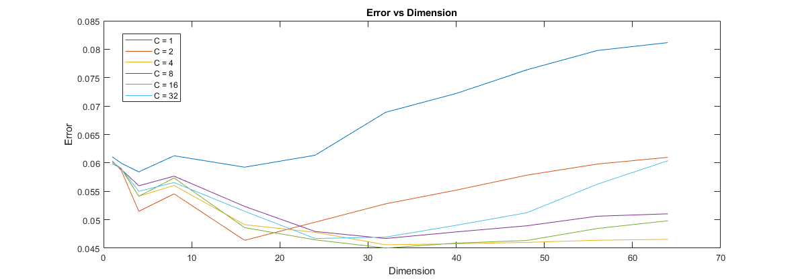

### P4 Report

------

##### 	This part we use the cheetah image to evaluate the performance of a classifier based on mixture models estimated with EM.

##### a)

In the first, we should randomly initialize the parameters. There are three parameters: $\pi _ { c }$, $\mu _ { c }$ and $\boldsymbol { \Sigma } _ { c }$. For the $\pi _ { c }$, I just use `rand()` and divided by the sum, which could make sure $= \sum _ { c = 1 } ^ { C } \pi _ { c } = 1$.For the $\mu _ { c }$ , I use `random()` to get value that random around the `mean(D)`, which is the $\mu _ { ML }$ of dataset. For the  $\boldsymbol { \Sigma } _ { c }$, I just set them as the same value for every time initialization, using $\boldsymbol { \Sigma } _ { ML }$. Now we can start the EM.

In the E-step, we should compute the likelihood of the COMPLETE data:
$$
\log P _ { \mathrm { X } , Z } \left( \mathcal { D } , \left\{ \mathrm { z } _ { 1 } , \ldots , \mathrm { z } _ { N } \right\} ; \Psi \right) = \sum _ { i , j } z _ { i }\log \left[ P _ { \mathbf { X } | \mathbf { Z } } \left( \mathbf { x } _ { i } | \mathbf { e } _ { j } , \Psi \right) \pi _ { j } \right]
$$
In the M-step, we should solve the maximization, and get the **new** parameter.For the Gaussian distribution, we have:
$$
\begin{aligned} h _ { i j } & = P _ { \mathbf { Z } | \mathrm { X } } \left( \mathbf { e } _ { j } | \mathbf { x } _ { i } ; \Psi ^ { ( n ) } \right) \\ & = \frac { \mathcal { G } \left( \mathbf { x } _ { i } , \mu _ { j } ^ { ( n ) } , \sigma _ { j } ^ { ( n ) } \right) \pi _ { j } ^ { ( n ) } } { \sum _ { k = 1 } ^ { C } \mathcal { G } \left( \mathbf { x } _ { i } , \mu _ { k } ^ { ( n ) } , \sigma _ { k } ^ { ( n ) } \right) \pi _ { k } ^ { ( n ) } } \end{aligned}
$$
$h _ { i j }$ means the probability of $\mathbf { X } _ { i }$ is $C_j$.

For $\pi _ { j }$, $\mu _ { j }$ and $\boldsymbol { \Sigma } _ { j }$:
$$
\begin{array} { r l } { \mu _ { j } ^ { ( n + 1 ) } } & { = \frac { \sum _ { i } h _ { i j } \mathbf { x } _ { i } } { \sum _ { i } h _ { i j } } } & { \pi _ { j } ^ { ( n + 1 ) } = \frac { 1 } { n } \sum _ { i } h _ { i j } } \\ { \sigma _ { j } ^ { 2 ( n + 1 ) } } & { = \frac { \sum _ { i } h _ { i j } \left( \mathbf { x } _ { i } - \mu _ { j } \right) ^ { 2 } } { \sum _ { i } h _ { i j } } } \end{array}
$$
One thing worth mentioned is that, we have to set a lower boundary for every entries of $\boldsymbol { \Sigma } _ { j }$ to avoid our code stuck.

With these new parameter, we can loop another EM till the parameters changes little after one loop. For me I judge `norm(mu_new - mu)/norm(mu)`.

Finishing the EM, we have our **trained** parameter and we can use it to classify pattern.
$$
P _ { X | Y } ( x | i ) = \sum _ { c = 1 } ^ { C } \pi _ { c } \mathcal { G } \left( \mathbf { x } , \mu _ { c } , \mathbf { \Sigma } _ { c } \right)
$$
To meet the requirement, I trained 5 parameters for BG and FG, here is the result. Every plot, the BG parameters are fixed, with the changing of FG 


As you can see, all 5 plots are pretty similar to each other. With the increasing of dimension, the PoE decrease with little fluctuation. Although the initialization may cause the parameters are different in every first loop of 5 BG/FG, with the EM, they are all coverage to stable point. In that case, the PoE do not depend too much on the initialization. However, a good initialization may reduce the times of EM loop. 

##### b)

In this part, we are supposed to change the $C$ as well. Here is the result:



As you can see, the trend of 6 different $C$ are similar. But when the $C$ is small, the PoE in high dimension situation tends to be increase. That may because of that, when $C$ is small, the mixture model is approach to common Gaussian distribution. Moreover, we diagnosed the $\boldsymbol { \Sigma } _ { j }$ , which result much bias. When the $C$ is large, the bias becomes little. 

___

#### Source Code

##### main.m

```matlab
clc;
clear;
init(); %   initialization
global D_BG D_FG py_BG py_FG;
%-------- Part 1 --------%
D = [1 2 4 8 16 24 32 40 48 56 64];

e1 = zeros(5,5,11);
P_BG55 = zeros(5, 11, 255, 260);
P_FG55 = zeros(5, 11, 255, 260);
for j=1:5
    %   get the 5 different parameters
    [pi_BG, mu_BG, Sigma_BG] = calh(D_BG,64,8);
    [pi_FG, mu_FG, Sigma_FG] = calh(D_FG,64,8);
    %   get the different likelihood of every pixel in different dimension
    for i=1:11
        d = D(i);
        P_BG55(j,i,:,:) = py_BG * callike(pi_BG, mu_BG(:,1:d), Sigma_BG(:,1:d,1:d));
        P_FG55(j,i,:,:) = py_FG * callike(pi_FG, mu_FG(:,1:d), Sigma_FG(:,1:d,1:d));
    end
end
%   cross 5 pairs of BG and FG likelihood matrix and get the PoE
for i=1:5
   for j=1:5
      for k=1:11
         P_BG = squeeze(P_BG55(i,k,:,:));
         P_FG = squeeze(P_FG55(j,k,:,:));
         e1(i,j,k) = cale(P_BG,P_FG);
      end
   end
end
for i = 1:5
    figure;
    plot(D,squeeze(e1(i,:,:)));
    xlabel('Dimension')
    ylabel('Error')
    title(['Error vs Dimension BG',mat2str(i)]);
end

%-------- Part 2 --------%
C = [1 2 4 8 16 32];
e2 = zeros(6,11);
for j = 1:6
c = C(j);
[pi_BG, mu_BG, Sigma_BG] = calh(D_BG,64,c);
[pi_FG, mu_FG, Sigma_FG] = calh(D_FG,64,c);

for i=1:11
    d = D(i);
    P_BG = py_BG * callike(pi_BG, mu_BG(:,1:d), Sigma_BG(:,1:d,1:d));
    P_FG = py_FG * callike(pi_FG, mu_FG(:,1:d), Sigma_FG(:,1:d,1:d));
    e2(j,i) = cale(P_BG,P_FG);
end

end
figure;
plot(D,e2);
xlabel('Dimension')
ylabel('Error')
title('Error vs Dimension');
```

##### init.m

```matlab
function [] = init()
%   initialization
load('Zig-Zag Pattern.txt');
A = imread('cheetah.bmp');
A = im2double(A);
global Apad zigzag correctImg D_BG D_FG py_BG py_FG dct;
Apad = padarray(A,[7 7],'symmetric','post');
zigzag = Zig_Zag_Pattern + 1;
correctImg = imread('cheetah_mask.bmp');
load('TrainingSamplesDCT_8_new.mat');
D_BG = TrainsampleDCT_BG;
D_FG = TrainsampleDCT_FG;
[szBG, ~] = size(D_BG);
[szFG, ~] = size(D_FG);
py_BG = szBG/(szBG + szFG);
py_FG = 1 - py_BG;

dct = zeros(255,260,64);
for i = 1 : 255
    for j = 1 : 260
        window = dct2(Apad(i:i+7, j:j+7), 8, 8);
        x(zigzag) = window;
        dct(i,j,:) = x;
    end
end 
end
```

##### cale.m

```matlab
function [e] = cale(P_BG,P_FG)
%   calculate the PoE
global py_BG py_FG correctImg;
calculatedImg = zeros(255, 270);

for i = 1 : 255
    for j = 1 : 260
        if (P_BG(i,j) < P_FG(i,j))
            calculatedImg(i, j) = 1;
        end
    end
end


% Calculate the error for 3 kind of solution result
eB2F = 0;% the times that the back point was misclassified as front
eF2B = 0;
numB = 0;% the number of back points
numF = 0;

for i = 1 : 255
    for j = 1 : 270
        
        if correctImg(i, j) == 255
            numF = numF + 1;
        else
            numB = numB + 1;
        end
        
        if calculatedImg(i, j)==0 && correctImg(i, j)==255
            eF2B = eF2B + 1;
        end
        if calculatedImg(i, j)==1 && correctImg(i, j)==0
            eB2F = eB2F + 1;
        end
    end        
end
e = py_FG*eF2B/numF + py_BG*eB2F/numB;
end
```

##### callike.m

```matlab
function [P] = callike(pi, mu, Sigma)
%   Calculate the likelihood
global dct;
[~, d] = size(mu);
P = zeros(255,260);
for i = 1 : 255
    for j = 1 : 260
        x = reshape(dct(i,j,:),1,64);
        P(i,j) = calp(x(1:d), mu, Sigma, pi);
    end
end
end

function [P] = calp(x,u,s,p)

P = 0;
[~, sz] = size(p);
for j = 1:sz
    P = P + mvnpdf(x, u(j,:), squeeze(s(j,:,:)))*p(j);
end
end
```

##### calh.m

```matlab
function [pi, mu, Sigma] = calh(D,d,c)
%   EM, return the trained parameters
[row, ~] = size(D);
H = zeros(c, row);
pi = rand(1,c);
pi = pi/sum(pi);
mu = zeros(c, d);
sigma2 = cov(D);
sigma2 = diag(diag(sigma2));
Sigma = zeros(c,d,d);
for i = 1:c
   Sigma(i,:,:) = sigma2(1:d,1:d);
   mu(i,:) = random('Normal', mean(D(:,1:d)), 1e-5);
end

% EM loop
loop = 300;
for p = 1:loop
    for i = 1:row
       for j = 1:c
          H(j,i) = mvnpdf(D(i,1:d), mu(j,:), squeeze(Sigma(j,:,:)));
       end 
    end
    H = H.*pi';
    H = H./sum(H,1);

    mu_new = zeros(c, d);
    Sigma_new = zeros(c,d,d);
    pi_new = zeros(1,c);
    
    for j = 1:c
       xd = D(:,1:d);
       h = H(j,:);
       u = mu(j,:);
       mu_new(j,:) = sum(h'.*xd)/sum(h);
       pi_new(j) = mean(h);
       dg = sum(h'.*(xd - u).^2)./sum(h);
       dg(dg<1e-10) = 1e-10;
       Sigma_new(j,:,:) = diag(dg);
    end
    % set the point of break out
    t = norm(mu_new - mu)/norm(mu);
    if t < 1e-5
       break; 
    end
    mu = mu_new;
    pi = pi_new;
    Sigma = Sigma_new;
end
p
end
```

